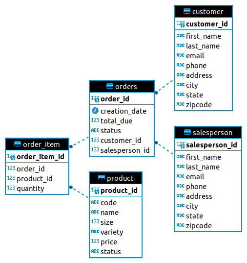

# JDBC

## Introduction
JDBC is an application that manage retail store data within a database. In other word, the application is connected through `JDBC` (Java Database Connection) driver to an `Docker` instance of Postgres `psql`. The application is responsible to provide create, read, update and delete (`CRUD`) functions for data persistence. These operations were implemented by using structural pattern `DAO` (Data Access Object) and `DTO` (Data Transfer Object) that allows us to isolate the application layer from the persistence layer using an abstract API.

### Technologies
* Git 
* Java SE 8 
* JDBC API 
* Apache Maven 
* PostgreSQL
* Docker
* DBeaver

## Implementation
### ER diagram

## Design Patterns
As I mentioned before we used `DAO` to implement `CRUD` to my project.
But we can implement `CRUD` by using repository pattern. It's a personal preference.

I used `DTO` with `DAO` as a pure abstraction layer. Regardless of which way we use, it provides a clear separation of persistence layer from business layer. 
The data transfer object `DTO` provides a single domain of data, and it's fully encapsulated objects that may also contain sub-objects like the concept of a tables with joins in `RDBMS`.

The differences between the repository pattern and `DAO` pattern is that the repository pattern focuses only on single-table access per class.
In some case, `DAO` could be a repository in the case where we are dealing with one table per class .
Instead of doing joining in the database, in the repository pattern, you join in the code. 
When we have distribution is where repositories pattern really have their strength. 

Complex joins in the database require a single instance of the database themselves that requires vertical scaling of your database.
But vertical scaling doesn't always work. And the repository pattern allows you to share your database in a way that you can focus on single-table access instead of accessing the entire database as a whole.

In the JDBC app I create 2 `DAO` class (CutomerDAO,OrderDAO) which implements the DataAccessObject interface. And 3 `DTO` (Order,Customer,OrderItem).

## Test
All the classes was tested manually by calling the functions in the main function.
For the queries results, I used `DBeaver` which is a database tool. I connect my `psql` instance with `DBeaver` and start executing the same queries and compare the result with the result from JDBC app.