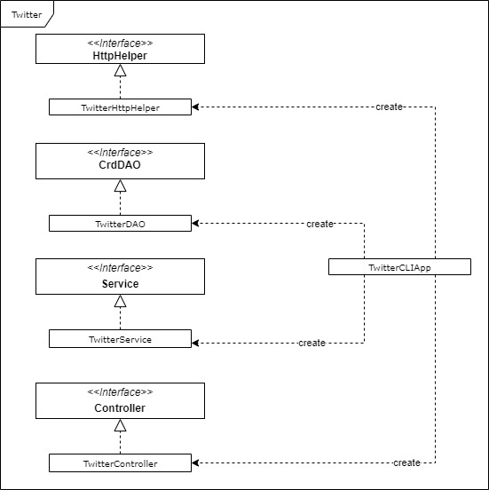

# Twitter CLI Application

## Introduction
Twitter CLI is an application to manage tweets in other word users can post, show and delete tweets using this application. I used `MVC` (Model - View - Controller) as design pattern to relate my front end with the back end. On the other hand, I used `DAO` (Data Access Object) pattern to isolate the business layer from the persistence layer. As a consumer, I used `HTTPClient` to send and receive requests/responses from the Twitter APIs providers (servers) and `Oauth 1.0` as an authorization method using `Twitter REST APIs`. 
To convert `JSON` responses to a `Tweet` object from Twitter APIs I used a `Java` library called `jackson-databind`. I chose `Apache Maven` as a project management tool which help me to handle all dependencies and the automation of the project's life cycle.`JUnit4` and `Mockito` frameworks used for unit and integration testing. And finally, `Docker` for deployment.

### Technologies
* Java 8
* Git
* Docker
* Twitter APIs
* JUnit4
* Mockito
* Spring

## Quick start
* Packaging Twitter app:
 ```bash
      mvn clean compile package
 ```
* Running Twitter app with Docker:
    <details><summary>Post a Tweet</summary>
        <p>
      Arguments:
      
  |   | Argument           | Description |
  |---|--------------------| -------------------------- |
       | 1 | tweet_text         | tweet_text cannot exceed 140 UTF-8 encoded characters |
       | 2 | latitude:longitude | Geo location |
    
        ```bash
            docker run --rm \
            -e consumerKey=YOUR_VALUE \
            -e consumerSecret=YOUR_VALUE \
            -e accessToken=YOUR_VALUE \
            -e tokenSecret=YOUR_VALUE \
            georgeshomsy/twitter_app post "arg1" "arg2"
        ```
    </p>
    </details>
    
    <details><summary>Show a Tweet</summary>
    <p>
      Arguments:
    
    |   | Argument           | Description | 
  |---|--------------------| -------------------------- |
    | 1 | tweet_id      | Tweet ID. Same as id_str in the tweet object |
    | 2 | [field1,fields2] | A comma-separated list of top-level fields from the tweet object (similar to SELECT clause in SQL) |
    
        ```bash
            docker run --rm \
            -e consumerKey=YOUR_VALUE \
            -e consumerSecret=YOUR_VALUE \
            -e accessToken=YOUR_VALUE \
            -e tokenSecret=YOUR_VALUE \
            georgeshomsy/twitter_app show "arg1" "arg2"
        ```
    </p>
    </details>

    <details><summary>Delete a Tweet</summary>
    <p>
      Arguments:

  |   | Argument  | Description |
  |-----------|--------------------| -------------------------- |
  | 1 | tweet_ids | A comma-separated list of tweets |

        ```bash
            docker run --rm \
            -e consumerKey=YOUR_VALUE \
            -e consumerSecret=YOUR_VALUE \
            -e accessToken=YOUR_VALUE \
            -e tokenSecret=YOUR_VALUE \
            georgeshomsy/twitter_app delete "arg1"
        ```
    </p>
    </details>
  
## Design
### UML diagram


### Components
#### TwitterHTttpHelper
TwitterHttpHelper is the layer responsible to communicate with Twitter REST APIs using HTTP with a given URI. It's also responsible to give authorization to the HTTP request using `Oauth 1.0`. For the authorization, we need 4 variables: consumer key,consumer secret, access token, token secret.

#### TwitterDAO
The TwitterDao is responsible to manage the Tweet object which is implemented with plain old Java object (POJO). So, when we need to post a tweet through TwitterHttpHelper, TwitterDAO create a Tweet object, transform this object to a JSON object and pass it to the TwitterHttpHelper.
In the case of show or delete TwitterDAO layer take the returned JSON object and transform it to a Tweet object.

#### TwitterService
This layer is the business logic of the application. It's the most important part of the application. In this layer, I validate the user input before passing it to the TwitterDAO layer.
I create multiple rules to valida inputs:
  1. First rule that a tweet can exceed 140 words
  2. Second rule I should validate the coordinates
  3. Third rule if the tweet ID is valid

#### TwitterController
TwitterController is the bridge between the view (TwitterCLIApp) and the business logic (TwitterService). So, it's retrieve the user input and call the corresponding service, and then it returns the result.

#### TwitterCLIApp
This layer is the view of my application.It will help to set up the components and their relationships.

## Modals
The modals are implemented with POJO. And basically these modals represents a simplified Tweet object.
Below a simplified tweet object:
```bash
{
   "created_at":"Mon Feb 18 21:24:39 +0000 2019",
   "id":1097607853932564480,
   "id_str":"1097607853932564480",
   "text":"test with loc223",
   "entities":{
      "hashtags":[],      
      "user_mentions":[]  
   },
   "coordinates":null,   
   "retweet_count":0,
   "favorite_count":0,
   "favorited":false,
   "retweeted":false
}
```
In this app, I create 5 modals:
  1. Tweet
  2. Entities
     1. Hashtags
     2. UserMention
  3. Coordinates

And all these modals above will represent a tweet object.

## Spring
As we mentioned before, that TwitterCLIApp creates 4 objects from differen