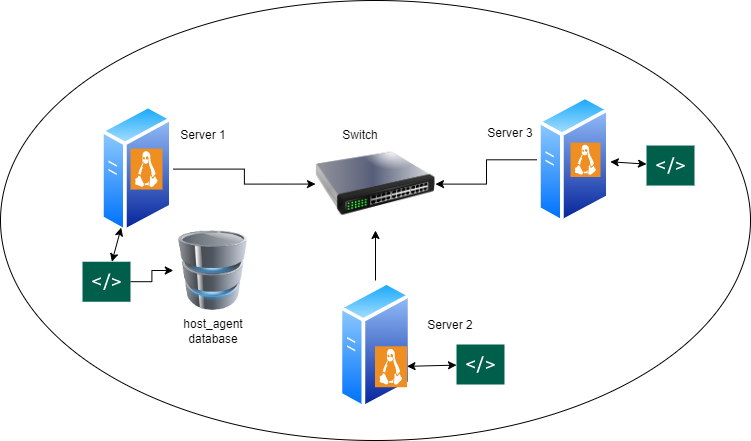

# Linux Cluster Monitoring Agent

## About this project
The linux monitoring agent is used by LCA (Linux cluster administration) to monitor and record the hardware and usage of (CPU/Memory) in real time for all the Linux servers running on `CentOS 7` distro and hosted on `GCP` (Google cloud platform). All the data is saved every minute in a relational database . The servers are all connected through a switch. All the data will be used for reporting purpose mainly to manage all the infrastructure in case they need to add or remove any server or to get more powerful cpu or memory. So it's very important to check that all the data collected by the agent is correct and meeting the need of the LCU.


### Technologies used:
* Bash commands
* Bash script
* Docker
* PostgreSQL
* GCP
* GitHub

### Methodologies used:
* Scum
* GitFlow

## Architecture


## Database Modeling
In this project we have 2 tables **host_info** and **host_usage**

<details><summary>host_info model</summary>
<p>
  
  * `id`: It's the primary key of the table. Serial field so it's auto generate number. -> SERIAL PRIMARY KEY NOT NULL
  * `host_name`: VARCHAR UNIQUE NOT NULL
  * `cpu_number`:	INT NOT NULL
  * `cpu_architecture`:	VARCHAR NOT NULL
  * `cpu_model`:	VARCHAR	NOT NULL
  * `cpu_mhz`:		FLOAT(4) NOT NULL
  * `L2_cache`:	INT NOT NULL
  * `total_mem`: INT NOT NULL
  * `timestamp`:	TIMESTAMP NOT NULL
  
</p>
</details>

<details><summary>host_usage model</summary>
<p>
  
  * `timestamp`:	TIMESTAMP NOT NULL
  * `host_id`:		INT NOT NULL
  * `memory_free`:	INT NOT NULL
  * `cpu_idle`:	INT NOT NULL
  * `cpu_kernel`:	INT NOT NULL
  * `disk_io`:		INT NOT NULL
  * `disk_available`:	INT NOT NULL

	CONSTRAINT fk_host_id FOREIGN KEY (host_id) REFERENCES host_info(id): this is a constraint to indicate that host_id is a foreign key to id the primary key 
  in the table host_info
  
</p>
</details>

## Usage
My project is divides into 2 folders:
* Scripts: contains all bash scripts `.sh`
* SQL: contains all sql file `.sql`
### Scripts
I used 3 bash scripts: 
1. `psql_docker.sh`: This script manage `psql` instance (PostgreSQL instance) on port `5432`. So psql_docker will create, start or stop the psql container. Depending on what the user enter as option the scipts will execute the command.
```bash
./scripts/psql_docker.sh start|stop|create [db_username][db_password]
```
2.Agent: After creating the tables it's time to collect data and insert them in these tables. So, for the insertion we are using 2 scripts `host_info.sh` and `host_usage.sh`. The `host_info.sh` will collect all the hardware informations and insert them into the **host_info** table and similary for the `host_usage.sh`.
To execute the 2 scripts we need to 5 arguments:
  1. psql_host: Host name
  2. psql_port: 5432
  3. db_name: host_agent
  4. psql_user: psql user
  5. psql_password: psql password

```bash
./scripts/host_info.sh psql_host psql_port db_name psql_user psql_password
./scripts/host_usage.sh psql_host psql_port db_name psql_user psql_password
```
NB: To connect to psql instance without a password you should set the environment variable `PGPASSWORD`:
```bash
export PGPASSWORD=USER_PASSWORD
```
To be able to get a real time data for the usage we should execute the `host_usage.sh` in a specified time. (For this project the time is 1 minute).
```bash
* * * * * bash /home/centos/dev/jrvs/bootcamp/linux_sql/host_agent/scripts/host_usage.sh localhost 5432 host_agent postgres password
```
<details><summary>Cron command explanation</summary>
<p>
  
  1. `*****`: Set schedule (You can check the [cron](https://crontab.guru/) website for more information.)
  2. `/....../host_usage.sh`: absolute path of `host_usage.sh`
  3. `host_usage.sh localhost 5432 host_agent postgres password`: execute `host_usage.sh` with the essential arguments.
  
</p>
</details>

### SQL files
1. `ddl.sql`: After creating the `psql` instance we can now create the tables to save the data. This scripts will automate the creation of the tables to avoid manual intervention. Before executing this script we should create a new database called **host_agent**. This script will create 2 tables **host_info** and **host_usage**. The **host_info** save all hardware informations while the **host_usage** will record the resource usage data.
##### Connect to the psql instance:
```bash
psql -h localhost -U postgres -W
```
##### Create new database **host_agent**:
```bash
postgres=# CREATE DATABASE host_agent;
```
##### Connect to the database:
```bash
postgres=# \c host_agent;
```
##### Execute ddl.sql script
```bash
psql -h localhost -U postgres -d host_agent -f sql/ddl.sql
```
2. `queries.sql`: List of queries for answering many buiness questions.

## Test
All the bash scripts are developed in a way that if any error occured it will stop the normal execution and indicate the error. So, once any error occur in a bash file we usually execute the bash file with `bash +x` command for debbuging. If not we compare the input with the result by using bash command. For the:

* `psql_docker`: Like we mentioned above this script is responsable of managing `psql` instance. So once we execute the script if no error, to verify that we got the expected result we can verify if the postgres container was created and running by typing:
```bash
 docker ps -f name=nameofthecontainer
```
* `ddl.sql`: We can verify by checking the `host_agent` database if the tables were created by using `\dt`.

* `host_info.sf` and `host_usage.sh`: We can verify by using `select` queries and check if they return records.

* `crontab`: We can verify the results in 2 ways:
  * By verifying the inserted record in the databse
  * By typing `cron -ls` to view all the crontab jobs

## Improvements
1. We should create a script with crontab to backup `host_agent` database each day.
2. Add a reporting tool to present the data in a better way


